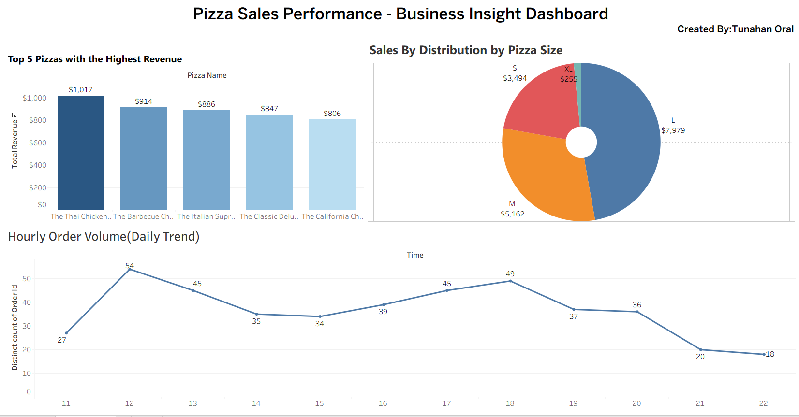

# 🍕 Pizza Sales Performance Analysis (SQL & Tableau)

### 📊 Project Overview
This project aims to optimize business performance for a pizza restaurant by analyzing sales data. Raw data was processed using SQL and transformed into an interactive dashboard in Tableau to uncover actionable insights.

### 🛠️ Tech Stack
- **Database:** SQL (PostgreSQL/MySQL)
- **Visualization:** Tableau (Interactive Dashboards)
- **Data Modeling:** Excel & SQL CTEs

### 🚀 Technical Highlights
- **Advanced SQL:** Cleaned and manipulated data using **JOINs, CTEs**, and **Window Functions (RANK, PARTITION BY)**.
- **Data Engineering:** Developed a structured master dataset for seamless visualization.
- **Tableau Features:** Implemented **Dual Axis** donut charts, **Time Series** analysis, and **Action Filters** for dynamic exploration.

### 💡 Business Insights
- **Rush Hours:** Identified peak order volumes during lunch (12:00-13:00) and dinner (17:00-19:00), suggesting staff optimization opportunities.
- **Top Product:** "The Thai Chicken Pizza" was identified as the primary revenue driver.
- **Sales Mix:** Analysis proved that "Large" pizzas contribute the highest share of total revenue, guiding inventory planning.

### 🔗 Links
- [Interactive Tableau Dashboard](PASTE_YOUR_TABLEAU_PUBLIC_LINK_HERE)https://public.tableau.com/app/profile/tunahan.oral/viz/PizzaSalesAnalytics-SQLTableauPortfolioProject/Dashboard1
